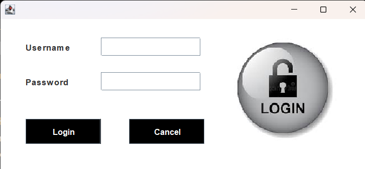
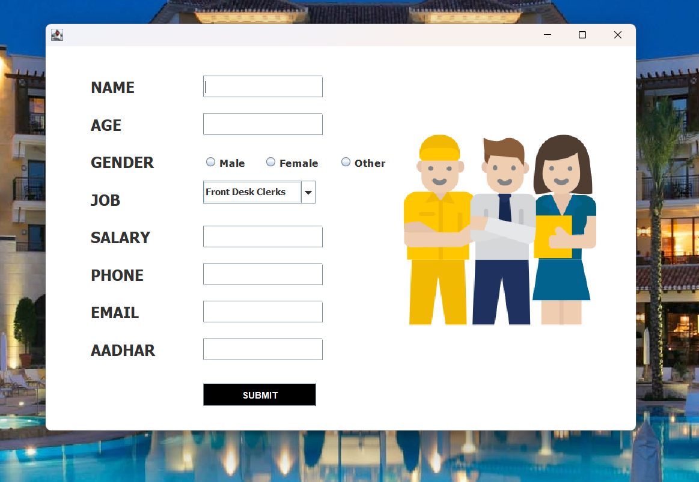
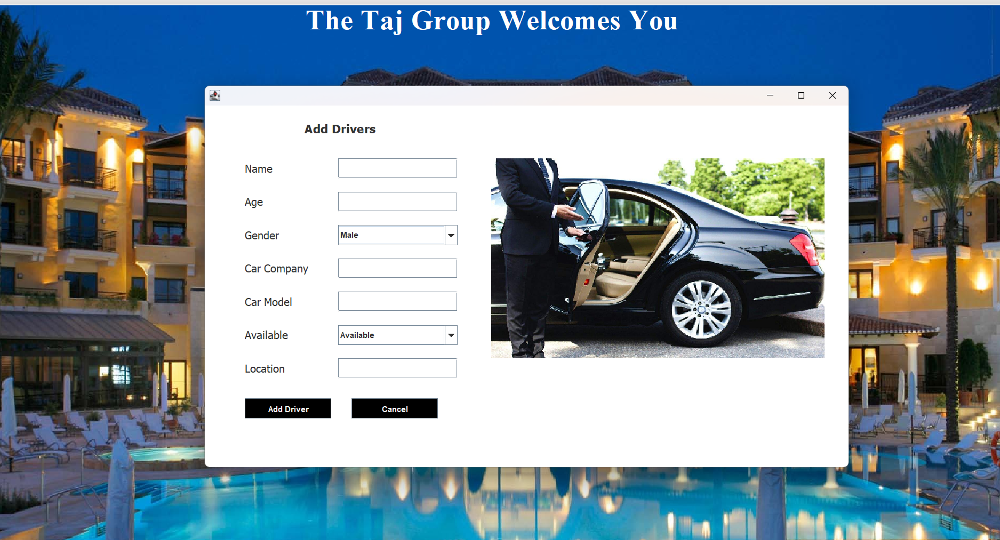
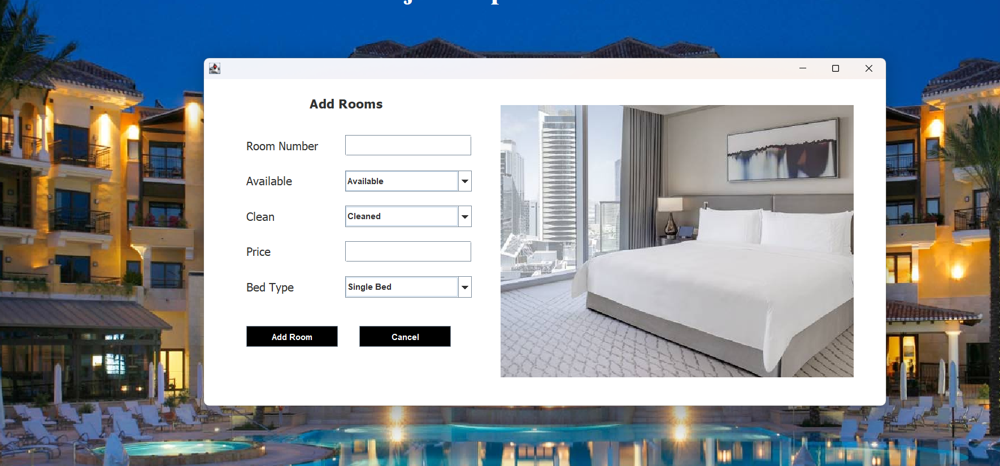
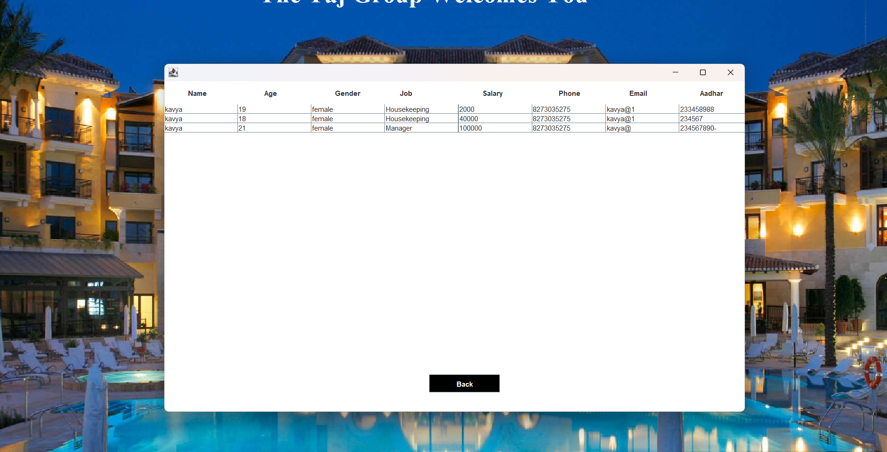
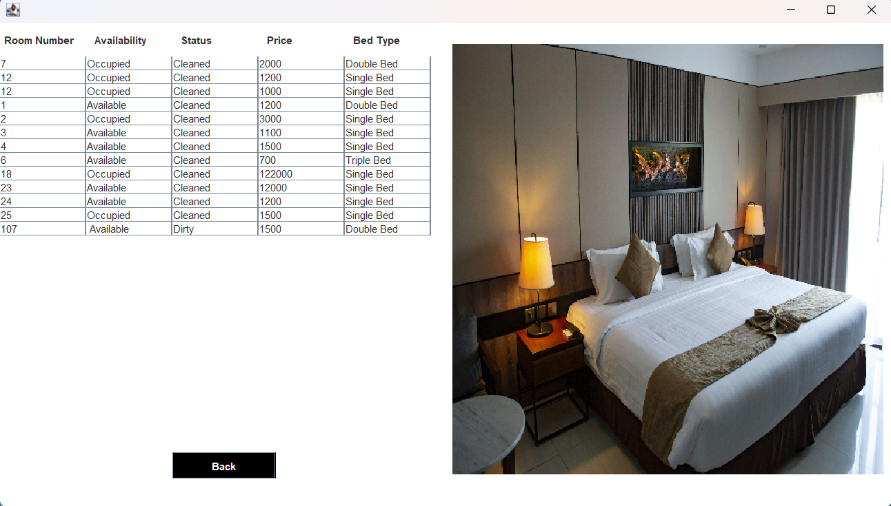

# Hotel Management System

A complete **Hotel Management System Desktop Application** developed using **Java Swing, JDBC, and MySQL**. The application automates hotel operations such as customer registration, room booking, employee management, driver management, room updates, checkout, and pickup services through an interactive graphical user interface.

---

##  Features

-  Secure Admin Login
-  New Customer Registration
-  Room Management
-  Department Information
-  Employee Management
-  Driver Management
-  Manager Information
-  Customer Information
-  Search Available Rooms
-  Pickup Service
-  Checkout System
-  Update Customer Status
-  Update Room Status
-  MySQL Database Connectivity using JDBC
-  Interactive Java Swing GUI

---

## 🛠️ Tech Stack

- Java
- Java Swing
- JDBC
- MySQL
- SQL
- NetBeans IDE
- Object-Oriented Programming (OOP)

---

##  Project Structure

```
Hotel-Management-System
│
├── src/
│   ├── hotel/management/system/
│   │      ├── Login.java
│   │      ├── Dashboard.java
│   │      ├── Reception.java
│   │      ├── AddCustomer.java
│   │      ├── AddEmployee.java
│   │      ├── AddDriver.java
│   │      ├── AddRooms.java
│   │      ├── Room.java
│   │      ├── Checkout.java
│   │      ├── Pickup.java
│   │      ├── SearchRoom.java
│   │      ├── CustomerInfo.java
│   │      └── ...
│
├── icons/
├── database/
└── README.md
```

---

##  Database

Database Used:

```
MySQL
```

Create a database named:

```sql
hotelmanagementsystem
```

Import the SQL file provided in the repository.

---

##  How to Run

1. Clone the repository

```
git clone https://github.com/YourUsername/Hotel-Management-System.git
```

2. Open the project in NetBeans IDE

3. Import MySQL Database

4. Configure database username and password in

```
Conn.java
```

5. Run

```
HotelManagementSystem.java
```

---

# 📸 Project Screenshots

## 🏠 Home Screen


---

## 🔐 Login Page


---

## 🖥️ Dashboard


---

## 🏨 Reception Panel


---

## 👤 Add Customer


---

## 👨‍💼 Add Employee


---

## 🚗 Add Driver


---

## 🛏️ Add Rooms


---

## 👥 All Employees


---

## 🛌 Rooms Information


---

## ✅ Checkout Module


##  Learning Outcomes

- Java Swing GUI Development
- JDBC Connectivity
- MySQL Database Integration
- CRUD Operations
- Event Handling
- Object-Oriented Programming
- Desktop Application Development

---

##  Author

**Kavya Tyagi**

GitHub:
https://github.com/KavyaTyagi18

---

##  If you like this project

Give this repository a ⭐ Star and feel free to fork it.
